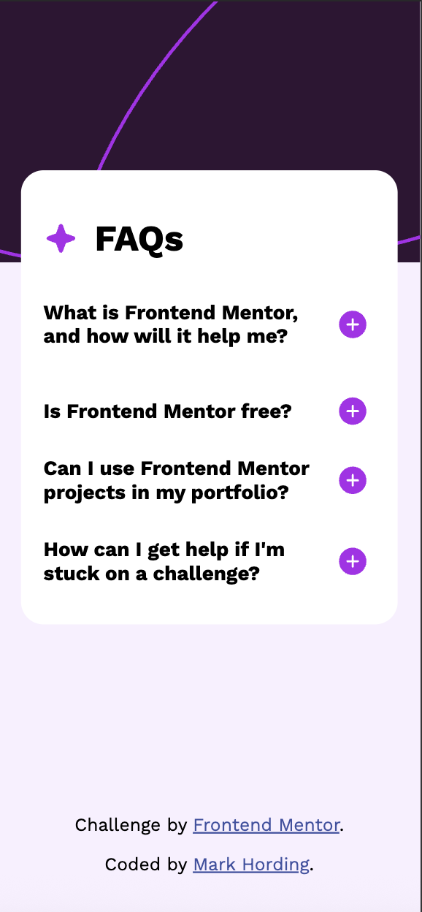

# Frontend Mentor - FAQ accordion solution

This is a solution to the [FAQ accordion challenge on Frontend Mentor](https://www.frontendmentor.io/challenges/faq-accordion-wyfFdeBwBz). Frontend Mentor challenges help you improve your coding skills by building realistic projects.

## Table of contents

- [Frontend Mentor - FAQ accordion solution](#frontend-mentor---faq-accordion-solution)
  - [Table of contents](#table-of-contents)
  - [Overview](#overview)
    - [The challenge](#the-challenge)
    - [Screenshot](#screenshot)
    - [Links](#links)
  - [My process](#my-process)
    - [Built with](#built-with)
    - [What I learned](#what-i-learned)
    - [Continued development](#continued-development)
    - [Useful resources](#useful-resources)
  - [Author](#author)

## Overview

### The challenge

Users should be able to:

- Hide/Show the answer to a question when the question is clicked
- Navigate the questions and hide/show answers using keyboard navigation alone
- View the optimal layout for the interface depending on their device's screen size
- See hover and focus states for all interactive elements on the page

### Screenshot



### Links

- Solution URL: [GitHub Repository](https://github.com/MarkBojeHording/FAQ-accordion)
- Live Site URL: [Live Demo](https://faq-accordion-mark.netlify.app/)

## My process

### Built with

- Semantic HTML5 markup
- CSS custom properties
- Flexbox
- Mobile-first workflow
- Vanilla JavaScript
- Google Fonts (Work Sans)
- SVG icons and graphics
- Responsive design with media queries

### What I learned

This project helped me strengthen my understanding of:

**JavaScript Event Handling:**
```javascript
document.querySelector('.icon-plus-free').addEventListener('click', function(e) {
  document.querySelector('.free-text').style.display = 'block';
  document.querySelector('.icon-minus-free').style.display = 'block';
  document.querySelector('.icon-plus-free').style.display = 'none';
});
```

**CSS Media Queries for Responsive Design:**
```css
@media (min-width: 769px) {
  .container {
    max-width: 500px;
    margin: 100px auto 20px auto;
    padding: 40px;
  }
}
```

**SVG Integration:**
```html

```

**Fixed Positioning for Persistent Elements:**
```css
.attribution {
  position: fixed;
  bottom: 5px;
  left: 85%;
  transform: translateX(-50%);
  z-index: 1000;
}
```

### Continued development

Areas I want to focus on in future projects:
- CSS Grid for more complex layouts
- CSS animations and transitions
- Accessibility improvements (ARIA labels, keyboard navigation)
- Performance optimization
- Cross-browser compatibility testing

### Useful resources

- [MDN Web Docs - CSS Media Queries](https://developer.mozilla.org/en-US/docs/Web/CSS/Media_Queries) - Helped me understand responsive design breakpoints
- [CSS-Tricks - A Complete Guide to Flexbox](https://css-tricks.com/snippets/css/a-guide-to-flexbox/) - Essential resource for flexbox layout
- [Google Fonts Documentation](https://developers.google.com/fonts/docs/css2) - Clear guidance on implementing web fonts
- [Frontend Mentor Community](https://www.frontendmentor.io/) - Great place for feedback and learning from other developers

## Author

- Frontend Mentor - [@markhording](https://www.frontendmentor.io/profile/markhording)
- GitHub - [@MarkBojeHording](https://github.com/MarkBojeHording)
